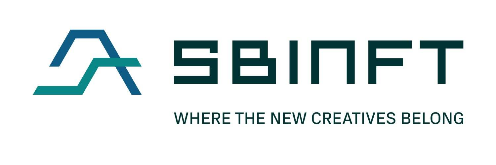

# SBINFT Market

新创意的归属地
基于 ETH/Polygon 链的策划市场
涵盖艺术/游戏物品/音乐/数字时尚
最初是一个名为 nanakusa 的市场，总部位于日本。
提供 190 位精选的 nanakusa 艺术家和合作伙伴并与之合作，其中包括企业、加密项目和 DAO。
2022 年 10 月加入 SBI 集团，并于 2022 年 3 月 17 日重新启动我们的市场。
策划市场是为用户提供可信赖的 NFT，同时也为艺术家创造创作者经济。
还致力于弥合加密货币与社会之间的差距。

