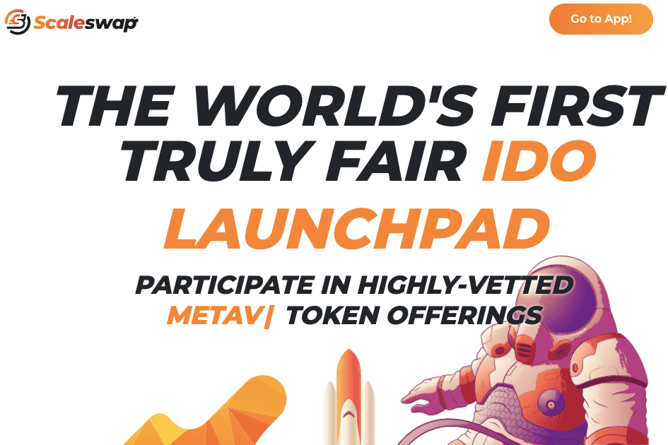

# Scaleswap

Scaleswap 提供了获得独家筹款机会的公平机会，使任何普通人都能够在公开上市之前以尽可能低的价格获得代币。作为回报，为创新项目提供众筹资金、建立可靠合作伙伴关系、加强社区和推向市场的工具和指导。
ScaleSCORE
ScaleSCORE 是向忠诚的社区成员致敬的革命性第一步。它是一个多维评分系统，根据用户的贡献和参与度赋予他们权力，对实际购买力的影响尽可能小。这意味着，只要致力于我们的使命、SCA 代币和我们的启动项目，任何人都可以随着时间的推移显着提高他们的 ScaleSCORE。
综合加速孵化服务
Scaleswap 提供的不仅仅是典型的 IDO 服务。我们来这里是为了确保我们管道中的每个项目，无论它们正在进行多长时间，都拥有成功和可持续地开发和启动的所有必要资源。
无与伦比的 IDO 选择过程
我们是 IDO 领域最具选择性的启动板，我们不会屈服于炒作的利基市场。迄今为止，我们收到的每 60 份申请中只批准了 1 份。 Scaleswap 拒绝了那些继续在其他专注于短期回报的高调启动板上启动的 IDO。很少有启动平台与我们一样，根据项目在 1 到 2 年后的成功潜力而不是启动时的“可泵性”来选择项目。

