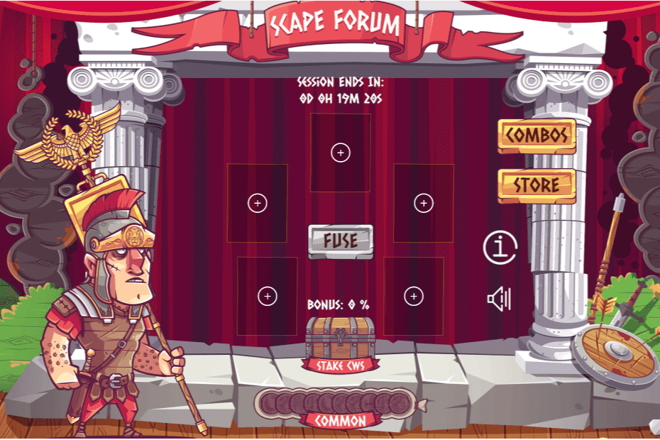

# Scape Forum

Scape Forum 是 Seascape Network 的第四款模块化 DeFi 游戏。在这款罗马主题的游戏中，玩家可以将 5 个更高代的 Scapes 组合成更早的一代和可能更高质量的 Scapes。获取更早更强大的 Scapes 以在整个 Seascape Network 上使用，以换取 Crowns 奖励。骑上你英勇的骏马，在海景基于 NFT 的游戏 Scape Forum中找到通往罗马之路！执政官在向你招手，帮助他找到新方法并带领罗马走向胜利！ 组合 Scapes 以合成更高品质的新 Scapes，质押 CWS 获得加成也能够帮助用户获得更低世代的 Scapes。

此外，燃烧特定组合，用户还可以获得罗马系列 Scapes 角色！

