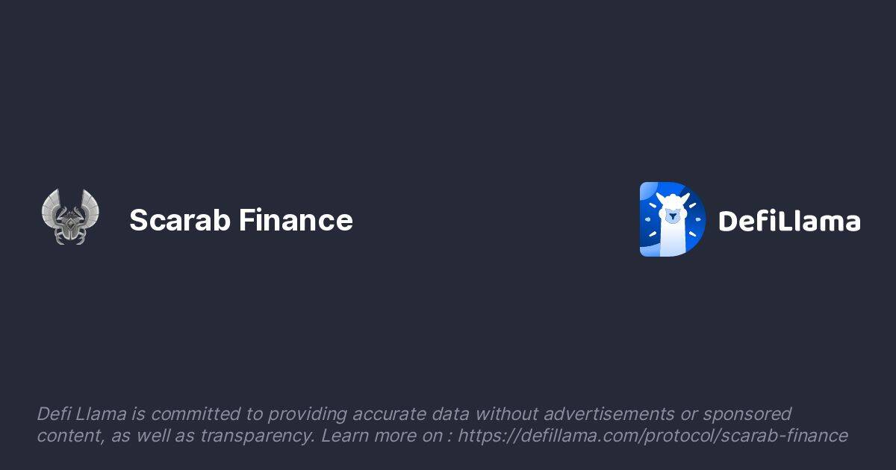

# Scarab Defi

圣甲虫在币安智能链区块链上工作。之所以选择这个区块链，是因为它独特地结合了卓越的技术和久经考验的可靠性。币安智能链的核心是以太坊区块链——加密世界中最受欢迎的（包括 DeFi）区块链，其使用量甚至超过了比特币区块链。地中海东部地区的一种大型蜣螂，在古埃及被视为圣物。
一种古埃及宝石，切割成圣甲虫的形状，有时描绘成展开翅膀，并在平坦的底面刻有象形文字。
任何金龟子。

