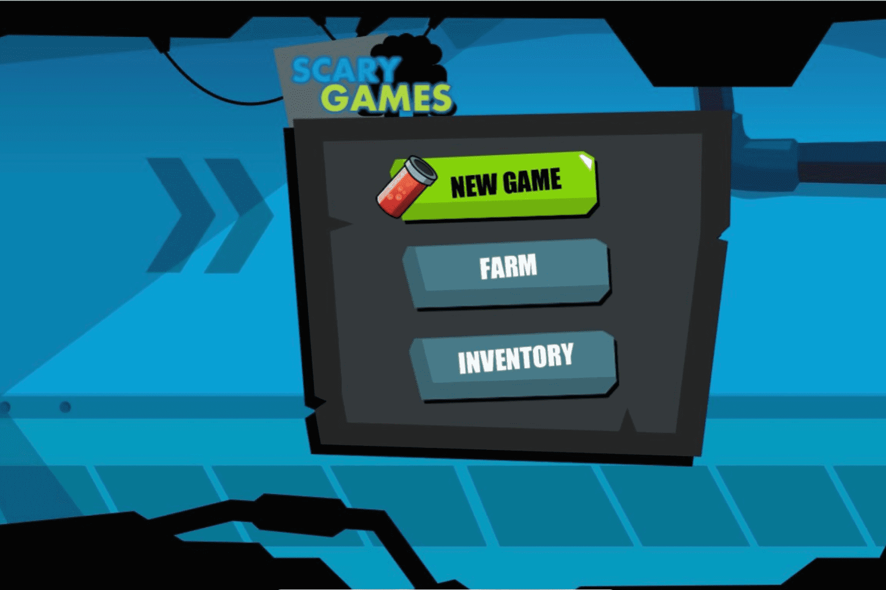

# Scary Doors

可怕的游戏是一个独特的项目，它具有一个基于区块链的集成游戏平台，它结合了沉浸式 NFT、农场和冒险任务，以在可怕的元宇宙中获得 $SCY。
该平台的原生货币允许玩家购买NFT，登陆元界并租用怪物进行战场。该公司拥有强大的背景，在葡萄牙和巴西拥有一支出色的团队，不断开发与 Scary 游戏平台的集成。
代币部署在 BSC 上，过程中涉及的 gas 费用非常低。还有Chainlink Verified Random Function (VRF)，通过所有权证明与独特和专有的NFT集成，因此用户可以拥有一个公平的游戏生态系统并避免恶意用户。
游戏机制
Scary games 的第一款 NFT 游戏包含一个基本系统，旨在奖励持有者和玩家。任何人都可以通过以下方式加入游戏：

  拥有 1,000 张 Genesis Monsters NFT 卡中的一张，并且是恐怖之门游戏的活跃玩家。玩家可以访问任意数量的门，每次访问都会获得奖励。
  只需从游戏中质押 300 Doors NFT 卡中的一张，这将在其他玩家的每次访问中产生被动收入和奖励。
  战场，沉浸在元宇宙中，在 PvP 模式下，用户可以与他们的怪物互动。
  Doors 拥有者将获得在其领土上的战斗或狩猎模式中生成的所有可怕代币的 10% 的奖励。

