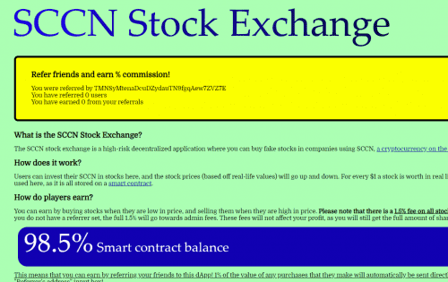

# SCCN Stock Exchange

什么是 SCCN 证券交易所？
SCCN 证券交易所是一个高风险的去中心化应用程序，您可以在其中使用 SCCN 购买公司的假股票，SCCN 是 TRC20 标准下 Tron 区块链上的一种加密货币。

玩家如何赚钱？
您可以通过在价格低时买入股票，并在价格高时卖出股票来赚钱。请注意，所有股票购买均需支付 1.5% 的费用。其中 0.5% 用于管理费用，1% 用于您的推荐人。如果您没有设置推荐人，则全部 1.5% 将用于管理费用。这些费用不会影响您的利润，因为您仍将获得无需费用即可获得的全部股份。这意味着您可以通过将您的朋友推荐给这个 dApp 来赚钱！他们购买的任何商品价值的 1% 将自动直接发送到您的 Tron 钱包！要推荐您的朋友，只需告诉他们将您的地址输入“推荐人地址”输入框即可！

风险
投资这个 dApp 会带来许多风险。

合同随时可能被耗尽。只有部分用户亏损，才能获得利润。这意味着不是每个人都可以保证获利，只有绝对战略性的用户才能保证获利。通过使用此 dApp，您将对发生的任何资金损失承担全部责任。
您投资的股票可能会上涨或下跌。如果托管股票价格的账户受到损害，我们不承担任何责任，因为这超出了我们的控制范围。通过使用此 dApp，您将对您投资的任何资金承担全部责任。只投资你能负担得起的。

