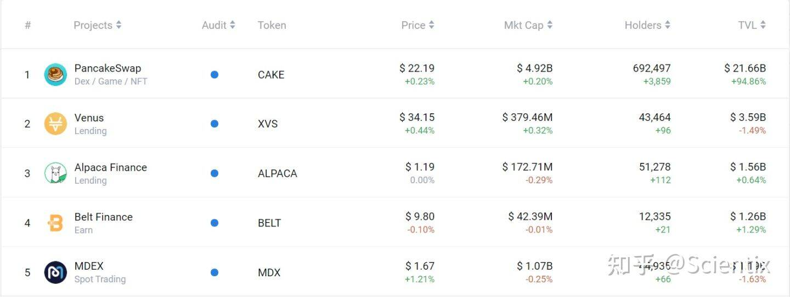

# Scientix

Scientix 是币安智能链上一个未来收益支持的合成资产平台。它允许您获得无息贷款，随着时间的推移还清，没有清算风险，而您的抵押品在后台为您赚取收益！PancakeSwap scUSD/BUSD 矿池奖励已关闭并转入 ACryptoS 的 scUSD-BUSD 矿池，请迁移您的 LP 继续耕种 SCIX。Scientix的工作过程非常容易理解：

\1. 首先你可以存入BUSD并贷出scUSD。

\2. 因为 scUSD 是一种与 BUSD 挂钩的镜像合成稳定币，所以贷款永远不会被清算。

\3. 同时，BUSD 抵押品将被部署到ALPACA金融的借贷金库中，赚取收益！BUSD不会被锁定，可以随时提取

\4. 随着时间的推移，产生的收益会自动偿还债务！

Scientix协议大大提高了资金效率，让用户可以提前支取未来的收益。Scientix没有锁仓，没有清算，可以随存随取，本金没有任何风险。

