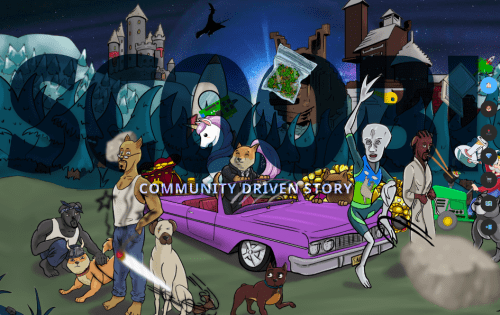

# SCooBi Doge

什么是史酷比狗狗？
这是一个社区驱动的故事漫画 NFT 项目，结合了一个赚取游戏项目的游戏，即 Scoobiverse。这些漫画书跟随我们的吉祥物 Scoobi Doge 的冒险进入他的加密任务，与各种知名角色相遇。每一页和每一本漫画书都有一个限量版，是金版和银版，并链接到 NFT。完整的漫画书也有黄金版和白银版，再加上数量有限的 NFT。有一个无限制且不与任何 NFT 链接的紫色版本，这些紫色版本将在世界各地的实体和虚拟商店中出售，并且通过该流产生的收入将用于随着时间的推移开发项目。我们将每年发布 2 到 4 幕。
如何获得 NFT？
其中一些 NFT 将被空投以奖励长期持有者、从不出售 Scoobi 代币的钻石手，或者至少不是他们所有的包。他们需要至少持有 1000 万美元的 SCooBi，每个持有人的重量是由定制的算法计算的，该算法考虑了每条链上持有的 Scoobi 数量，提供的 LP（这进一步增加了重量）和持有这些代币的时间。计算方法是购买的总金额乘以您持有它们的小时数。
史酷比宇宙呢？
第一阶段基于我的世界，我们的元宇宙“史酷比宇宙”是一个你可以在你真正拥有的虚拟土地上构建你自己的各种东西的宇宙。引入工艺来赚钱，我们正在将区块链技术与我的世界引擎相结合。最终游戏，如果我们获得足够的收入来实现它，那将是一个回合制纸牌游戏，您可以在其中玩每一集。

