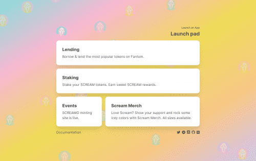

# SCREAM

SCREAM 是一个基于 Fantom 的借贷协议，适用于 Fantom。 SCREAM 提供完全去中心化、透明和非托管的点对点借贷解决方案。 SCREAM 旨在为更传统的加密资产借贷服务建立高速市场，但目标是提高更广泛的基于 Fantom 资产的整体资本效率。
类似于（并基于）现有的借贷平台，如 Compound Finance、Aave 和 C.R.E.A.M。金融，用户将能够在我们的货币市场上借出任何受支持的资产，并使用他们的资本作为抵押品来借入受支持的资产。
在启动时，SCREAM 将支持一定数量的资产的借贷货币市场，社区治理预计将在 2021 年第三季度至第四季度全面实施（有关更多详细信息，请参阅治理）。

