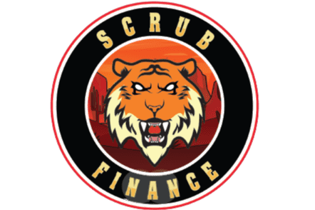

# Scrub Finance

$LION 算法代币是快速发展的生态系统的支柱，旨在为 cronos 网络和 Savannah 金融协议带来流动性和新用例。该协议的底层机制动态调整 $LION 的供应量，使其价格相对于 $SVN 的价格上涨或下跌。
受 Basis 及其前身（bDollar 和汤）背后的原始想法的启发，Scrub Finance 是一个多代币协议，由以下两个代币组成：-Lion ($LION)。 -老虎股（$TIGER）
Scrub Finance 由 DIGITS DAO 孵化。我们的目标是扩展 MMF 生态系统并创建一个真正的动态协议。我们将帮助扩展 Meerkat 生态系统，创造互补产品，增强 MMF 生态系统内的社区体验。我们的最终目标是创建一个跨链算法稳定币，将在多条链上并行使用，作为多链转移资金的一种方式。
与以前的算法代币不同，LION 没有与稳定、gas 或 DEX 代币挂钩，而是与 SVN 挂钩。最重要的是，与其他项目不同，我们能够在现有的 MMF-SVN 生态系统之上构建，这使我们能够更好地控制这两个代币之间的机制如何交互。
该团队相信 Savanna Finance 的全部潜力，并完全致力于为 SVN 的未来增长提供价值并从中获得价值。
过去算法令牌的主要缺点之一是缺乏用例，没有充分的理由让某人想要使用或持有它们。为了长期成功地保持挂钩，Scrub Finance 团队将继续专注于围绕增强功能和用例的创新。
我们采用了三种代币结构：LION、TIGER、LBOND。

