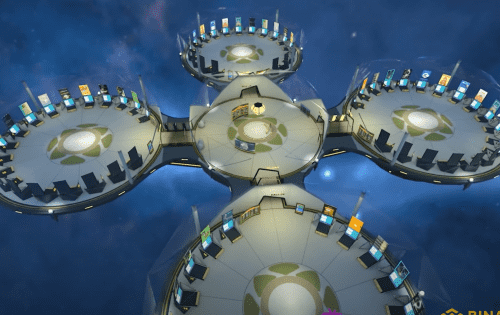

# SecondLive

SecondLive：选择生活，选择空间，选择朋友。成为您想要的偶像，在展览、舞池、购物中心、工作场所等空间自由漫游

SecondLive是BSC上的元宇宙項目，它是一個多元化的3D虛擬空間，你可以使用自己的虛擬形象，在不同的空間中進行許多現實生活中的活動，比如舉辦展覽、唱歌、跳舞、購物，你也可以創作自己的內容，並且從中獲利。2021年10月中下旬SecondLive發佈了個人Space，具備社交，遊戲，直播，等功能。其代幣治理SLT也通過Space産出。

2021年11月3日，SecondLive宣佈獲得Binance Labs種子輪融資，估值3000萬美元。

