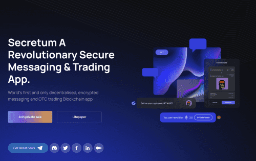

# Secretum

Secretum – 去中心化、加密的消息传递和场外交易 dApp。 Secretum 的使命是让去中心化的消息传递和交易变得无缝。它兼容 DeFi 和元界，被定位为 Web 3.0 时代的首选解决方案。Secretum 提供：通过钱包、OTC、P2P 交易（包括 NFT）进行验证和访问智能公共渠道，世界上第一个也是唯一一个在 Solana 区块链 dapp 上进行去中心化、加密的消息传递和场外交易。通过插入钱包公共地址，您可以开始与其他 NFT、加密货币和代币持有者聊天以进行交易。如果钱包还没有在平台上 - 不用担心，我们会将 SER 代币与您的消息交换给他们。

