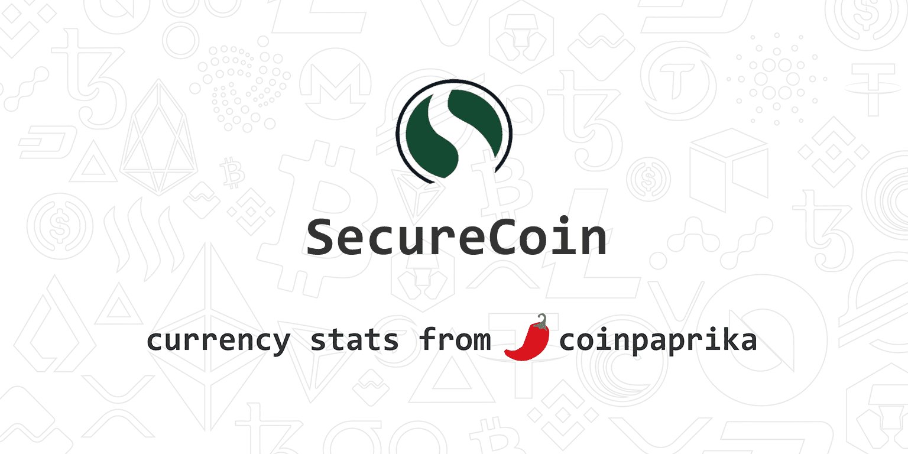

# SecureCoin

Secure Coin 是一种创新的 BEP-20 代币，旨在通过各种机制保护投资者，确保他们的投资。有适当的机制来确保不会发生地毯，没有鲸鱼可以操纵价格，没有机器人会以比用户更好的价格购买。专用钱包也将很快交付给我们的用户。Secure Coin  (是一种基于比特币的快速安全的加密数字货币。这些规范经过精心挑选，以维持比特币的经济模型。单个散列算法会带来安全风险，因为如果它被破坏，整个网络就会永远受到破坏。多种散列算法不仅可以降低风险，还可以增加额外的复杂性，让任何攻击者都可以渗透，从而增强了网络的安全性。

