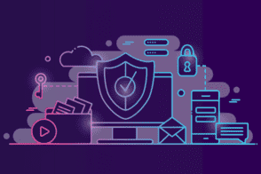

# SecureSwap

xxxxxxxxxx 由于公共区块链的透明性，去中心化金融（DeFi）资产经常受到监控和网络犯罪。投资者和单产农民可能会因为交易受到监控、技术逆向工程和抢占先机而失去竞争优势。•SecureSwap 协议可助您一臂之力。我们为用户提供利用最先进的区块链技术的可交换、抵押匿名数字资产。•借助创新的“隐私价格”发现系统，用户可以通过将任何区块链中的加密货币存入 SecureSwap 保险库并在生态系统内的各种 DeFi 应用程序中使用它们来创建零知识数字资产。

