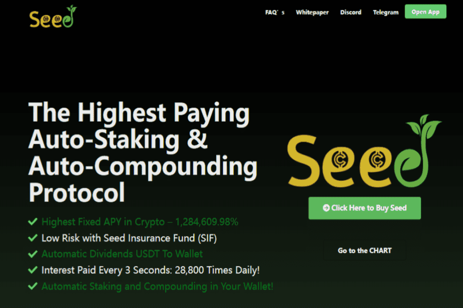

# SEED

Seed协议是DeFi第一平台，APY最高，自动反射USDT
-- Seed 提供了一种去中心化的金融资产，通过使用其独特的专有 SAPR 协议，以可持续的固定复利模型奖励用户。
Seed 的开发人员引入了 Seed Autostaking Protocol Reflection (SAPR)，这是一种 DeFi 3.0 协议，它提供了一种去中心化的金融资产，通过使用其独特的专有协议，以可持续的固定复利模型奖励用户。
种子自动质押协议反射 (SAPR) - 最高固定 APY
SAPR 为代币持有者提供简单性、安全性以及从他们的质押中获得 1,284,609% APY 的一致固定高收益回报。它用于种子代币，为其提供以下行业优势：
质押 - 简单安全
Seed 代币始终保留在您的钱包中，无需交到第三方或中心化机构手中。您需要做的就是购买并持有，因为您会自动在自己的钱包中收到奖励，因此根本没有更复杂的质押过程。
利息收益 - 自动付款
Seed 在前 12 个月的回报率为 1,284,609%，可与迄今为止 DeFi 领域的任何东西相媲美。
快速支付利息
Seed 协议每 3 秒或每天 28,800 次向每个 Seed Token 持有者支付费用，使其成为加密货币中最快的自动复合协议。
自动令牌销毁
种子协议的一个令人兴奋的功能是一个名为“The Fire Pit”的自动令牌燃烧系统，它可以防止循环供应失控并变得无法管理。 Fire Pit 消耗了所有种子代币市场销售额的 1.0%。
关于种子

