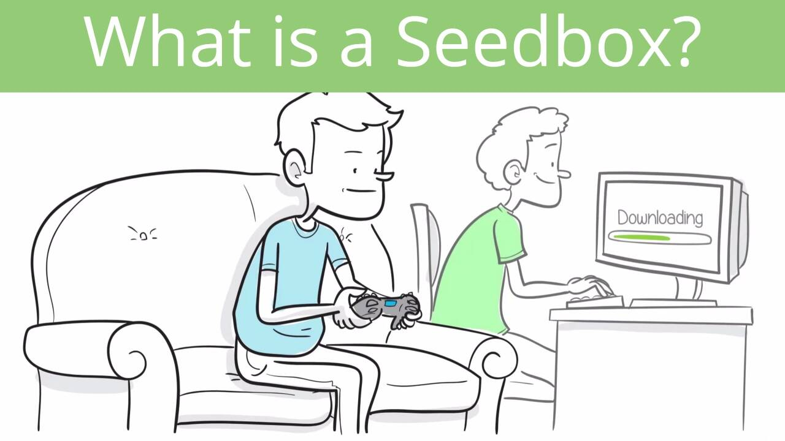

# SeedBox

SeedBox 是一个基于 Polygon 的原生一体化平台，它授予
散户投资者可以获得风险投资。
我们专注于构建具有多种格式的多格式启动板
平台上的去中心化和多链服务。核心
功能是 IDO 和 VC 访问、Staking 和 Farming 池。
作为 IDO 启动板，SeedBox 旨在为投资者和
项目平等和有利条件。对于我们的社区成员
我们提供安全、透明和公平的方式来参与高收益
早期阶段的加密项目，包括风险投资，但没有
强大的资本或特殊的准入。
关于项目，我们建议另一种分发方式
以分散的方式分配，扩大投资者的受众。
使用基于多边形的生态系统来促进发展和
资助基于以太坊、币安智能链、Solan 和
多边形链以完全去中心化的方式。

