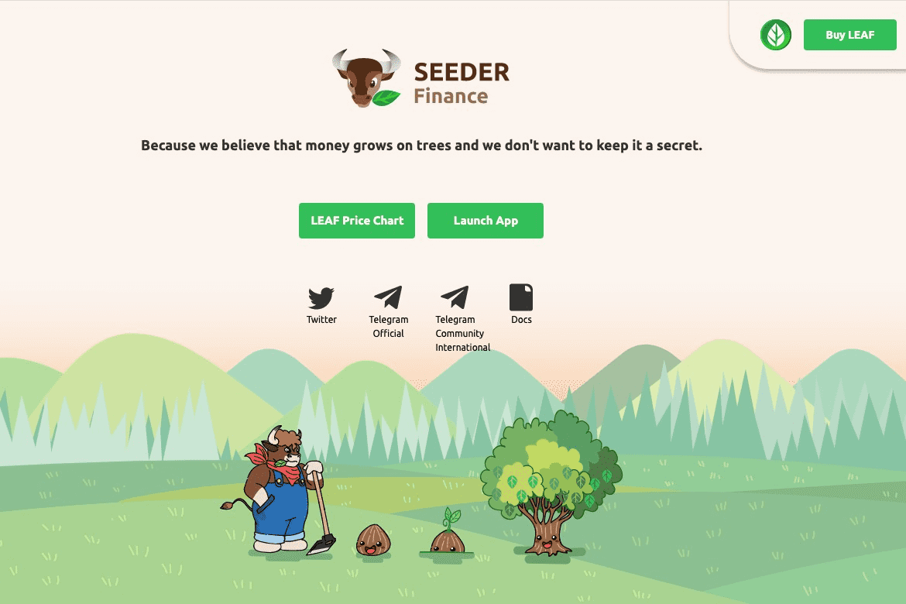

# Seeder Finance

SEEDER Finance 是最简单的 DeFi 项目，允许在币安智能链上进行杠杆收益农业。它允许用户从整个平台的播种和耕作以及活动中获得最大的回报和利。DeFi 项目，提供从锁定的总价值中进行质押、耕种和利用的所有功能。但除了基本的 DeFi 用例外，该平台还将提供 2 个独特的用例，即 LEAF4FUN 和 LEAF4FUND。LEAF4FUN 将提供一个即插即用的游戏平台，其中包含一个连接世界知名角色的 NFT 市场。鉴于，LEAF4FUND 旨在创建基金代币来代表对现实世界加密基金的投资。

