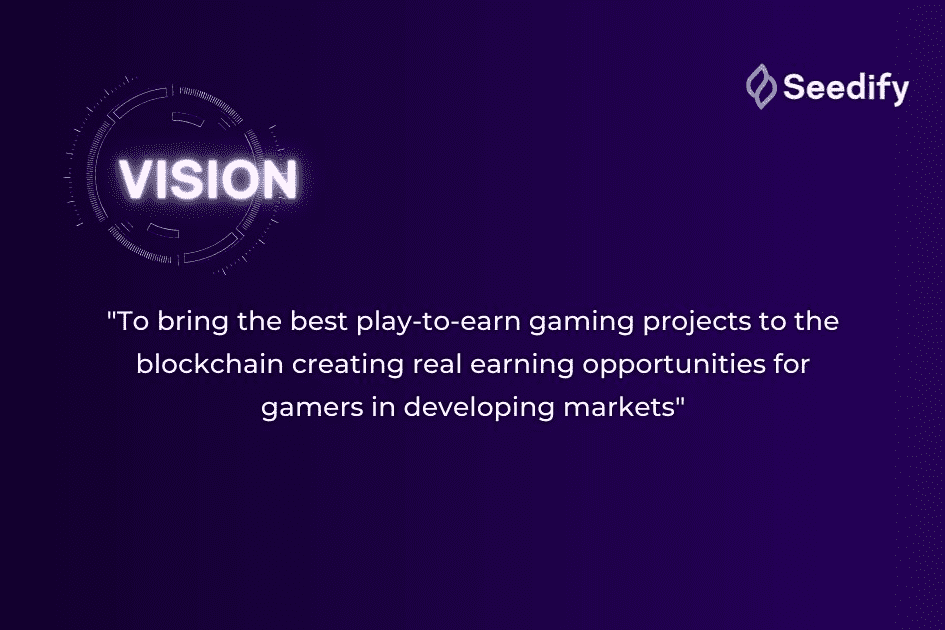

# Seedify

Seedify 是一个专注于区块链游戏的孵化器和启动平台，通过获得资金、社区和合作伙伴关系以及一个完整的支持系统来帮助创新者和项目开发人员，以帮助推动游戏和区块链的未来。
Seedify 为 SFUND 持有者引入了一种新的质押方式，有机会从 Seedify 孵化计划选择和支持的项目中获得代币。
Seedify 还具有一个带有分层分配机制的启动板，允许 SFUND 代币持有者在优质游戏项目投放市场之前获得访问权限。 Launchpad 层系统由九层组成。第 1 层使用基于彩票的分配过程，而第 2 至 9 层参与者享受保证分配。

