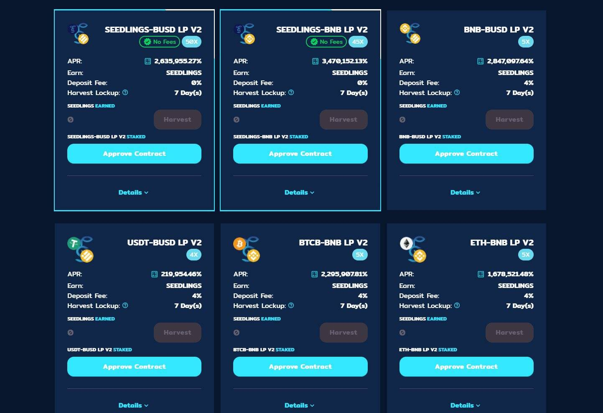

# SeedMoney Finance (Layered)

SEEDS 上线后，我们注意到 Harvest Lockup 对每个人来说并不相同，因此可能会导致相互套利倾销，不像 Lavacake 每个人都有相同的锁定，这对每个人来说都更加公平和公平。需要更长时间的 Harvest Lockup 和持续营销，最后，排放量太高，无法长期可持续发展。
实施新层的目的是产生对原始原生 SEEDS 代币的需求。从从事分层农业的众多农场的成功可以看出，SeedMoney Finance 也将开发一个新的层，即 SEEDLINGS。
通过在分层农业中保持原生代币池的高乘数，我们将使 SEEDS 更有价值，为社区带来更多潜在投资者。用户可以使用更便宜的 SEEDS 代币来种植更昂贵的 SEEDLINGS。
这有什么不同？

  具有与 Lavacake 相似的代币经济学的新层！
  7天锁仓，每个人锁仓相同
  SEEDS 持有者使用他们的 SEEDS 投资新层（使用收获 SEEDS 赚取更多钱！）
  排放量大大降低
  公平层使用预售机制推出新层
  我们会根据社区的反馈坚持4%，鼓励投资者购买原生代币
  自动流动性增加 (1%)
  自动刻录 (1%)

