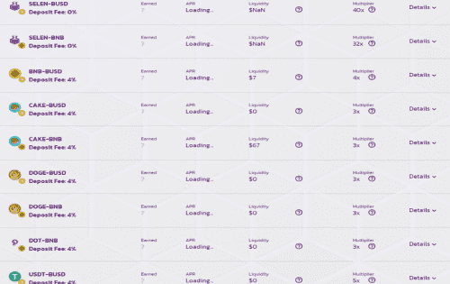

# SeleniumSwap

我们通过修改合约解决了以下这些问题：我们如何防止 Rugpull
Selenium Swap 是 Binance 智能链上全新的去中心化交易所，被称为第二代收益耕作机制，它允许永久价格上涨，并在发布时通过 Timelock 合约实现可持续且有利可图的耕作收益！
我们希望创建一个 Selenium 代币 (SELEN) 供每个人使用！！我们的最终目标是过渡到完整的 AMM，通过使用 $SELEN 进行交易和 Play & Win 区域创建一个 NFT 市场。

  大资金进出造成较大波动。
  使用稳定币不断创建代币，无需任何贡献
  代币烧毁不足
  拉格拉
  删除了迁移代码
  Timelock 在启动时添加到合同中
  TechRate 审计
  安链审计
  由 EtherAuthority 审计

