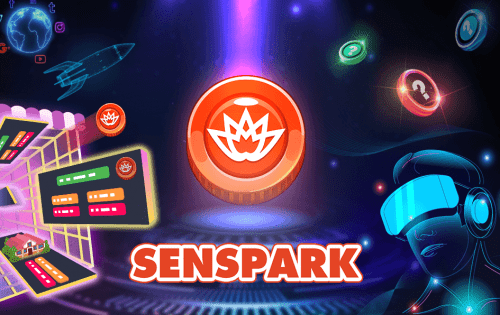

# Senspark

SEN 采用革命性的代币经济体系，结合了 DeFi 和 NFT 的优势，利用金融机制和游戏系统为玩家赋能。为货币化生态系统创造一个真正独特且持久的游戏。
  短期：成为一个平台，帮助扩展为参与 Gamefi 生态系统的大量用户提供服务的能力。通过支付部分奖励。持有 SEN 代币的玩家可以参与决策过程，并在元界平台上获得许多好处。
  长期：Senspark Metaverse是一个去中心化的虚拟现实社交网络平台，允许用户参与和体验电子商务、商业、会议、娱乐、私人空间、农业等所有活动，连接跨平台的NFT系统和经济系统是科学设计和可持续的。来自世界各地的玩家将聚集在这片广阔的空间中。

