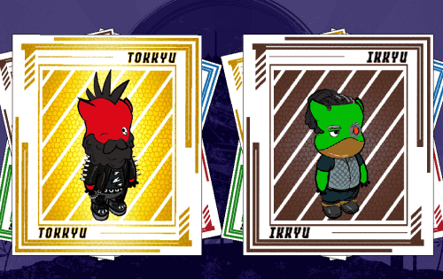

# Sentoki NFTs

SENTOKI NFT 系列的目的是什么？
Sentoki 是 2888 个 Sentoki NFT 的集合——位于 Solana 区块链上的独特的诅咒数字战士。您的 Sentoki 兼作公民身份，可以访问 Norowareta Uchu 质押系统，每天赚取 10 美元 JUMON（或更多取决于您的 Sentoki 等级）。
每个仙时都以 Yonkyu 等级开始，这是一个等级系统，当您花费 $JUMON 达到更高等级时，等级系统会更高。 （更高的稀有度 = 更高的产量）
有关更多信息和详细信息，请查看我们的白皮书

