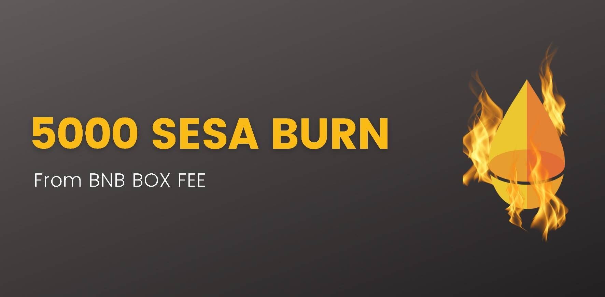

# Sesame Token Mystery Box

#1 基于 BSC 链的去中心化神秘盒子游戏
与在黑盒中运行的传统游戏不同，芝麻游戏运行在公平、透明、非托管和不可变的智能合约上。此外，只要您参与，每个人都通过 SESA 代币成为游戏的共同所有者！
为什么我们更好？
随处可用——没有政府禁令，没有 KYC。
向任何人开放——无需注册，您只需要一个加密钱包。
非托管 - 不需要存款，只有您可以随时使用您的资金。
即时支付——在您获胜后，支付会自动发送到您的加密钱包。
开源——我们的智能合约可以在 BSC Explorer 上进行验证。
通货紧缩——我们有上限供应，所有费用的 20% 用于回购和销毁 SESA。
质押——质押您的 SESA 代币以赚取更多！因此，您可以在睡觉时赚钱。
利润分配——与其他项目不同，我们通过分红模型赋予代币价值，其中 50% 的房屋利润在排名奖励和回购方面返还给我们的用户。
规则和概率
游戏设计
在芝麻谜盒游戏中，一个高价值的奖品被分成多张票。参与者以固定成本购买每张门票。当售出足够的票时，将随机选择一张中奖票。参与者能够以相对较少的风险资本赢得大量回报。
必读：规则
1. 玩 SESA Box 时只能挖 SESA 代币（无论赢与否）。
2. Play BNB box不会为你挖任何SESA代币。
3. 20%的BNB盒费用于回购销毁SESA。
4. 每日前3名玩家可获得10%的BNB盒费。
5.游戏至少需要2人玩。

