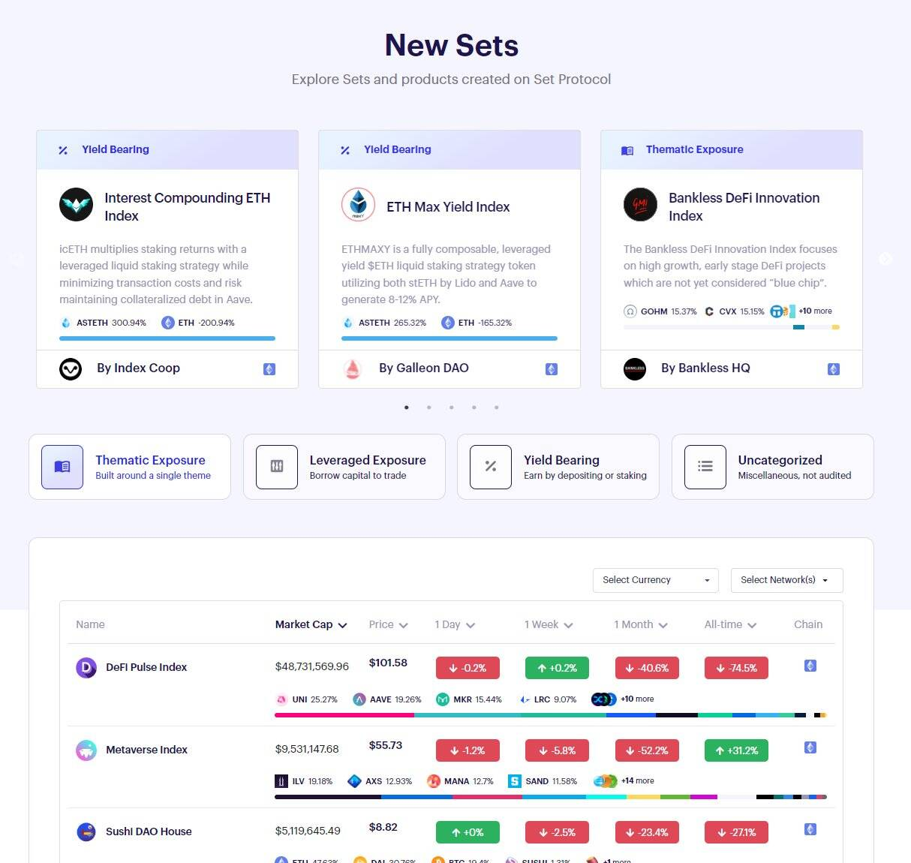

# Set Protocol

Set Protocol 是一种建立在以太坊上的非托管协议，允许创建、管理和交易 Sets、ERC20 代币，这些代币代表一个投资组合或一篮子基础资产。每个 Set 根据其智能合约中编码的策略运行并定期重新平衡其投资组合。 Set Protocol 于 2017 年 11 月发布，其第一个面向用户的应用程序 TokenSets 于 2019 年 4 月推出。TokenSets 目前支持 DAI、ETH、WBTC、USDC、cUSDC 和 LINK。使用 Set 领先的投资组合管理工具将您的加密策略变为现实。使用支持 AAVE 和 Compound 等 DeFi 服务的高级交易工具管理您的 Set。

