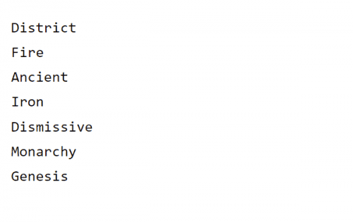

# Settlements

一开始有一首歌，安静而忧郁，几乎不引人注意，淹没在乌尔的巨大存在中。
乌尔，万有之母，万有，众神的女神，所有存在都在她的怀抱中，所有世界都被温柔地拥抱，直到它们不再存在，必须重新出生。比这首歌更古老，对它的旋律漠不关心，但在宇宙的和谐中与它的每一个永恒的音符产生共鸣。
这首歌唤醒了 The Builder 还是 The Builder 本身就是这首歌？数百年来，在凯斯凯拉学院的烛光研究中，这个问题一直是争论、内容和学术争论的焦点，它导致了战争、失去了友谊以及许多哲学上的愤怒和头痛，但一个现在对我们的故事并不重要。重要的是建造者崛起，他们开始建造。
建造者的思想通过一个又一个地表现出一个存在层面，将它们编织在一起，就像只有瓦尔哈拉的好人知道如何制作的最好的篮子的肋骨一样，直到它们变得完整。高山升起，形成山谷，山谷充满水，将山脉碾成灰尘，变成平原，只是重复这个循环，直到它在建造者眼中完美。
位面之间形成了阴影，阴影如此黑暗，以至于没有光能穿透它们或将它们赶走，慢慢地啃咬着位面的边缘，但在它们所有的邪恶和毁灭中都是必要的。建造者不惧怕阴影，因为一切都必须结束，才能重新建造和更新。
建造者醒了，睡梦变成了模糊的记忆，就像一首歌的音符在众生的注视下唤醒了他们。
有很多东西要建造。

