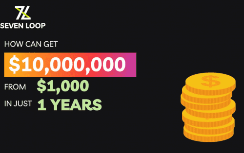

# SevenLoop

Defi 中最高可持续的 Auto-stake/compound 协议
SELO 每 7 分钟以 1,000,000.00% 的可持续固定 APY 奖励持有者。 （这是 BSC 中的理论限制）例如：投资 1000 美元 SELO 在短短 12 个月内获得 10,001,000.00 美元 SELO。
SevenLoop Auto-Stake 功能是一个简单而先进的功能，称为 Hold2Earn，它为 $SELO 持有者提供了终极易用性。
Hold2Earn - 只需在您的钱包中购买并持有 $SELO 代币，您就可以获得 rebase 奖励，作为直接存入您钱包的利息。您的代币将每 07 分钟增加一次。

