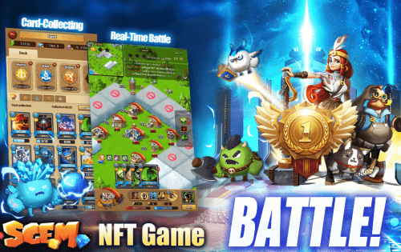

# SGEM

SGEMVERSE 是一个基于以太坊的多层交互式元节。玩家可以在 SGEMVERSE 中购买自己的英雄加入战斗、玩游戏以赚取代币、制作 NFT 进行交易以及与其他玩家互动。我们的代币是所有嵌套游戏和社区中的通用货币，玩家资料通过单点登录 (SSO) 在所有游戏中运行。
SGEM City 的灵感来自于传统的塔防游戏，是 SGEMverse 推出的第一款区块链游戏。实战游戏支持英雄（NFT）收集与进化、结构与基地建设、扑克牌收集、塔防，以及迷宫探索、冒险、寻宝。创新的战斗模式由卡牌、英雄和防御结构组成。我们的 Play-to-Earn 模式和独特的全年奖励锦标赛真正体现了 Play 4 Fun 和 Play 2 Earn 的概念！

