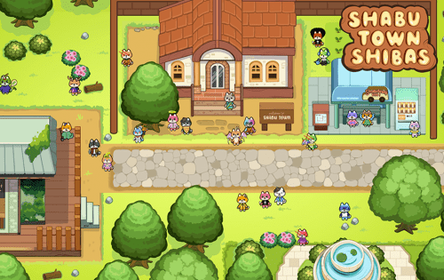

# Shabu Town Shibas

Shabu Town Shibas 是一款 P2E Metaverse/NFT MMORPG，玩家可以使用他们可爱的 Shibas 在 Shabu Town 中探索、战斗和赚钱！涮锅小镇作为下一代Web3.0产品开发，旨在结合社交、游戏和NFT，为您带来领先的元界。Shabu Town 中的 Shiba 角色，适合所有人的元宇宙和 NFT MMORPG。Shabu Town Shibas NFT 在过去 7 天内售出 24 次。 Shabu Town Shibas 的总销售额为 66.97 美元。 Shabu Town Shibas NFT 的平均价格为 2.8 美元。有 3,198 名 Shabu Town Shibas 所有者，拥有 10,000 个代币的总供应量。

