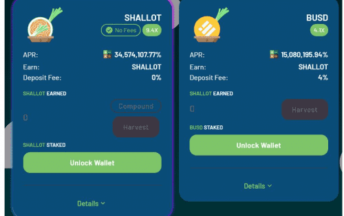

# Shallotdefi

自动流动性自动燃烧反鲸鱼
主要特点‌
ShalotDefi 的每次转让必须缴纳 5.5% 的转让税。 4.4% 的转让税通过合约自动添加到流动性池中，以不断提高价格下限。这种流动性是自动锁定的。
正如我们上面提到的，ShallotDefi 的每笔转让都必须缴纳 5.5% 的转让税。 1.1% 的转让税将分配给自动流动性获取。 1.1%的剩余转让税将立即被烧掉。整个过程是自动的。
超过总供应量 0.15% 的转账将被拒绝。随着总供应量的增加，这个比例会降低。

