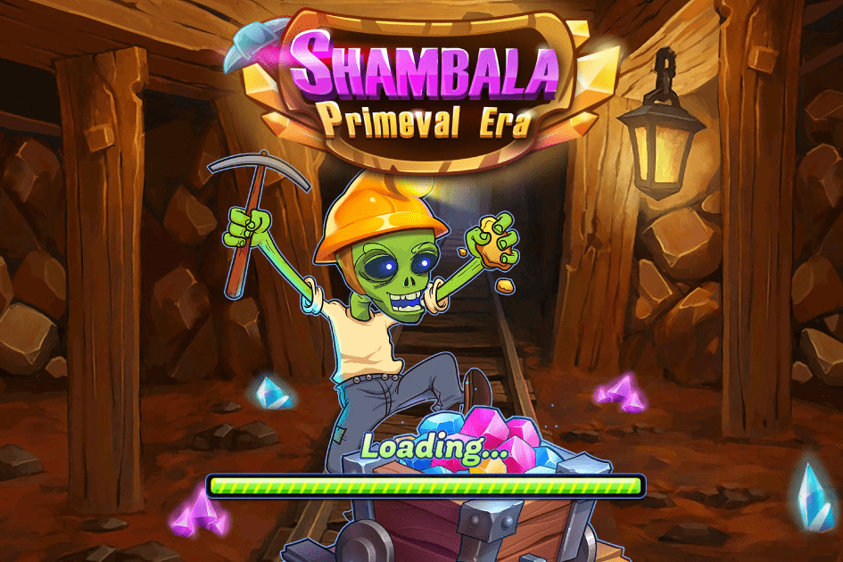

# ShambalaGame

香巴拉是一个由玩家打造的去中心化游戏平台。拥有一块土地，用户可以获得香巴拉元界的唯一门票，你可以在土地上挖矿获得收益和神秘宝箱，参与香巴拉农场时代，打造属于自己的建筑，动物和植物，您将有机会设计和建造自己的虚拟空间，例如音乐会体育场、艺术品拍卖展厅等。香巴拉风暴是一款神话般的甲板建造纸牌游戏。它具有甲板建设、城市建设和战略元素的惊人组合。拥有四种资源（攻击、智慧、金币和魔法）的生产能力，游戏允许大量的创意策略。

