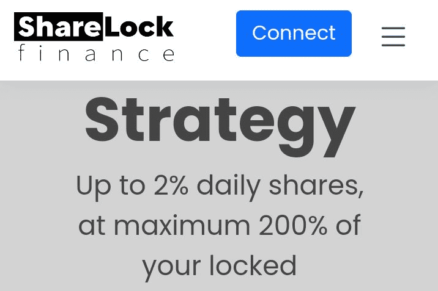

# ShareLock Finance

ShareLock- 公平设计
公平是我们 dApp 的核心价值。
每日最多 2% 的份额，最多为您锁定投资的 200%。
（您的股票价值根据 TVL 波动。TVL 增长时价值增加，TVL 缩小时价值减少。）没有人愿意投资一个平台，不得不担心第二天 TVL 会下跌 99%，而得不到任何回报。我们创建了自己独特的反流失机制，该机制考虑了 TVL/玩家总数，因此一旦达到此限制，奖励将停止建立，玩家将不得不撤回他们的奖励（在 7 天计时器之后涨了），或者增加新的资金继续积累奖励。

