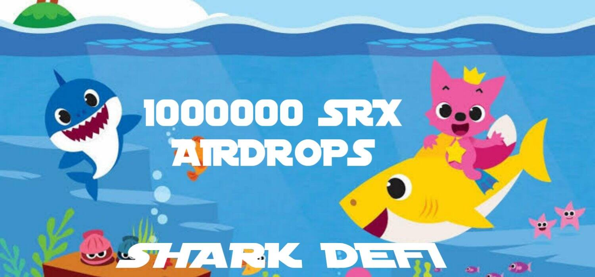

# Shark Defi

使用区块链基础设施实现隐私高保证和无摩擦计算。为庆祝 $SRX 代币的推出，我们很高兴地宣布为前 1000 名会员进行#SRX 空投，并在#coinsniper 上为 $SRX 代币投票。我们拥有最新的总加密货币市值、全球交易量图表和市场概况。关注趋势加密货币、比特币主导地位、流行的加密货币、最新的加密资产，并确定市场上最大的加密赢家和输家。总的加密货币市值是通过将每个单独的加密货币的市值相加来计算的。CoinCheckup 目前列出了 19371 种加密货币。

