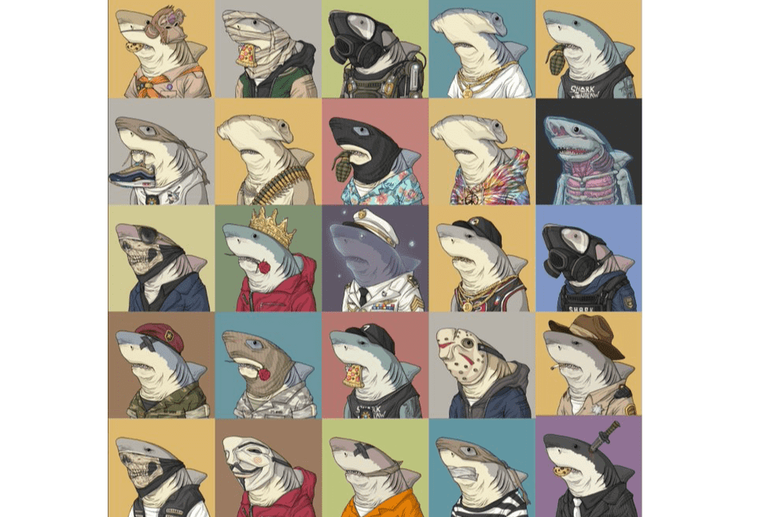

# Shark Outlaw Squad

Shark Outlaw Squad (SOS) 是 7,777 个以犯罪为主题的鲨鱼 NFT 的集合，其中包含两个对立的小队：Justice 和 Outlaw，它们将在镇上最大的小队战争的 D 日发生冲突。
这场小队战争围绕鲨鱼中央银行的一个神秘金库展开。 Team Justice 相当于这些在城市中巡逻并遵守规则（包括避难所的禁止进入法令）的鲨鱼的法律和秩序。但是，一群反叛者和被遗弃者组成的 Team Outlaw 着眼于终极突袭，以掠夺隐藏在 The Vault 中的东西。凭借全面的武器战，这些鲨鱼准备在城市中撒下灰尘和火药。

