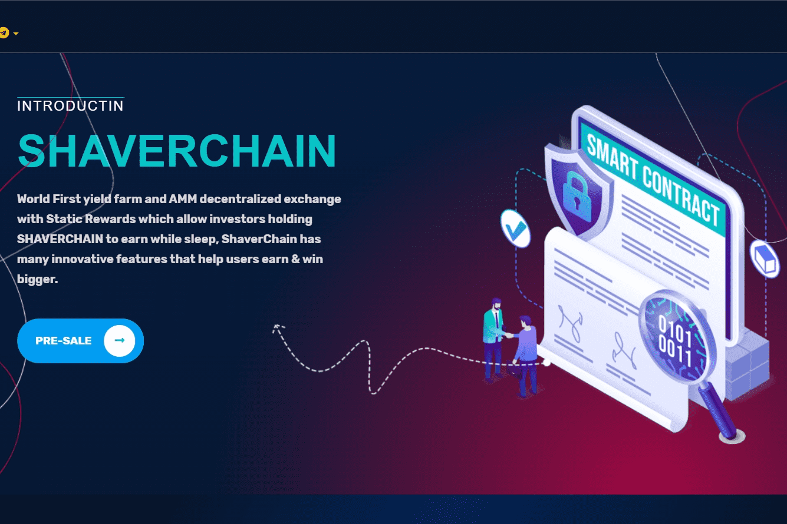

# SHAVERCHAIN

ShaverChain - SHAVERCHAIN 是一个快速、去中心化的区块链系统，为去中心化金融、NFT 和元界赋能。它安全地连接大多数主流区块链，同时提供极快和低成本的交易。特别是 ShaverChain - SHAVERCHAIN 是一个具有 3 种介绍的 SHAVERCHAIN 快速培养相当广泛的无缝质量向量和想法共享。方便邀请您的朋友并在他们每次在 SHAVERCHAIN 上进行交换时获得一定的佣金奖励，并在 Farms & Launchpools 中获得他们收入的 1%。在 SHAVERCHAIN 协议上，会发生三个不同的功能：回购、销毁和奖励。

