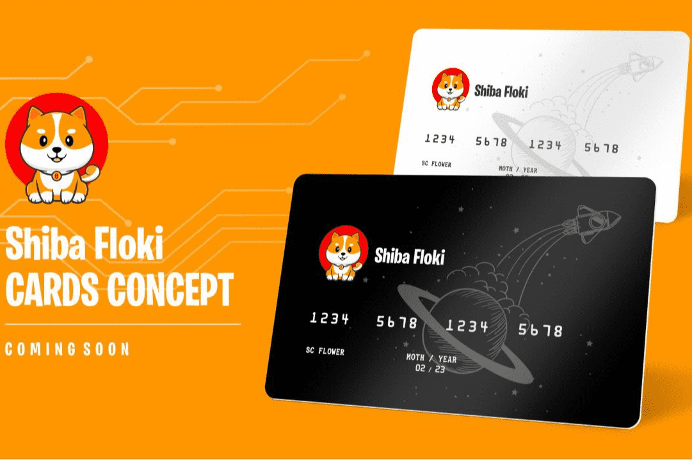

# Shiba Floki

什么是 Shibafloki 令牌？
在币安智能链上运行的 shibafloki 是最新的加密货币，源自 meme 之父 DogeCoin。更具体地说，它是一种超通缩的山寨币，在生态系统中内置了智能共享系统，因此每个用户的钱包中都添加了更多的 shibafloki。这意味着持卡人在 shibafloki 网络上进行的每笔交易都会自动获得 5% 的佣金。
Shibafloki 可能是最新的模因硬币热潮，其价值即将爆炸。
据称，这枚硬币是由伊隆马斯克的粉丝创造的，旨在提高交易速度和“崇拜”。与 DOGE 的 60 秒相比，该代币的出块时间为 5 秒，并且通常更便宜的汽油费率。
Shibafloki 仍处于起步阶段，无论是在项目进度还是市场价值方面。但正在取得进展——埃隆马斯克的简洁评论点燃了人们对这个致力于狗的新项目的热情。

