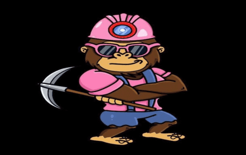

# SHIBA MINER FINANCE

什么是 SHIBA 矿机？当我的桶装满时会发生什么？我可以取回最初的存款吗？矿工工作多长时间？费用是多少？推荐如何运作？
SHIBA Miner 是一个基于币安智能链的去中心化应用程序，每天至少向您支付 3% 的 SHIBA 存款到 SHIBA Miner 合约中。每日投资回报率百分比取决于几个因素。
您的矿工将停止为您工作，直到您复合（雇用更多矿工）或索取（口袋）您的 SHIBA div。这是保持人们参与的一种方式。
一旦您存款，您将无法收回。随着时间的推移，您只能通过将 SHIBA div 装袋而慢慢地赚回它。
只要合约充满资金，矿工就会无限期地为你工作。它们不能出售或交换。
在每笔存款中，2.5% 进入团队钱包以进行进一步开发，2.5% 进入营销钱包以发展平台和 Miner Apes 品牌。
将钱包连接到网站后，您将在页面底部看到您的推荐链接。在您的链接下存款的人是您推荐的，您可以获得他们存款价值的 10%。所以带上你的朋友和伙伴！

