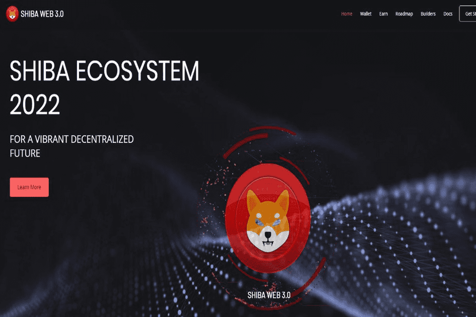

# SHIBA WEB3.0

THE SHIBAVERSE LANDS 在游戏中与区块链互动 拥有您的物品的所有权 玩在线游戏以获得奖品 在游戏中使用 NFT 数字拍品的买家将能够赚取被动收入、收集游戏内资源并产生奖励。SHIBA WEB 3.0 是一个充满可能性的新世界。每个用户能够标记资产、将信息放在网络上并使用数字..Shiba Inu Web 3.0（shibweb3）是一种加密货币，部署在币安智能链（BSC BEP-20）上。Shiba Inu Web 3.0 是一个去中心化的金融支付网络，它在区块链上重建了传统的支付堆栈。它利用一篮子与法定货币挂钩的稳定币，通过其储备货币 shibweb3 进行算法稳定，以促进可编程支付和开放金融基础设施的发展。截至 2020 年 12 月，该网络已为超过 200 万用户进行了估计 2990 亿美元的交易。

