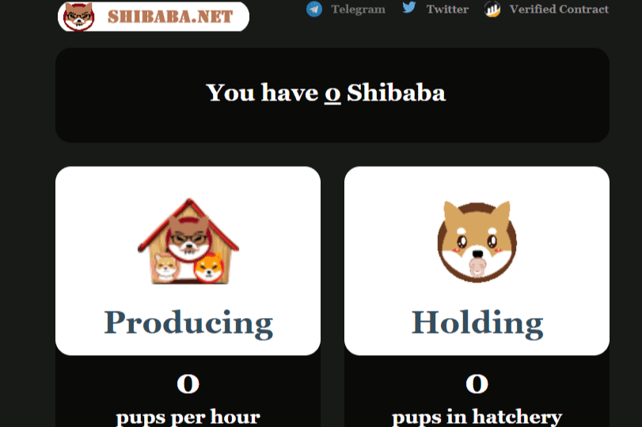

# SHIBABA BSC Farm

BSC 上的 DAPP 农场游戏购买 SHIBABA，生成小狗并出售 BNB。SHIBABA BSC Farm 是一款放置类游戏。你买了 SHIBABA，开始生产幼崽，然后卖掉它们以获取利润。SHIBABA BSC Farm 是一款闲置的加密游戏。它基于 BSC。该游戏允许您以被动方式种植代币。首先，您需要购买 SHIBABA 代币。然后这些代币将生成幼崽，然后可以出售以获取 BNB 利润。通过分析最近 30 天窗口的 SHIBABA BSC Farm dApp 数据，可以看出 dApp 的Balance**为**$ **0.00**，**Volume****稳定**在**$0.00**。**SHIBABA BSC Farm在30天内产生10 笔交易**，**变化率为 0%**。

