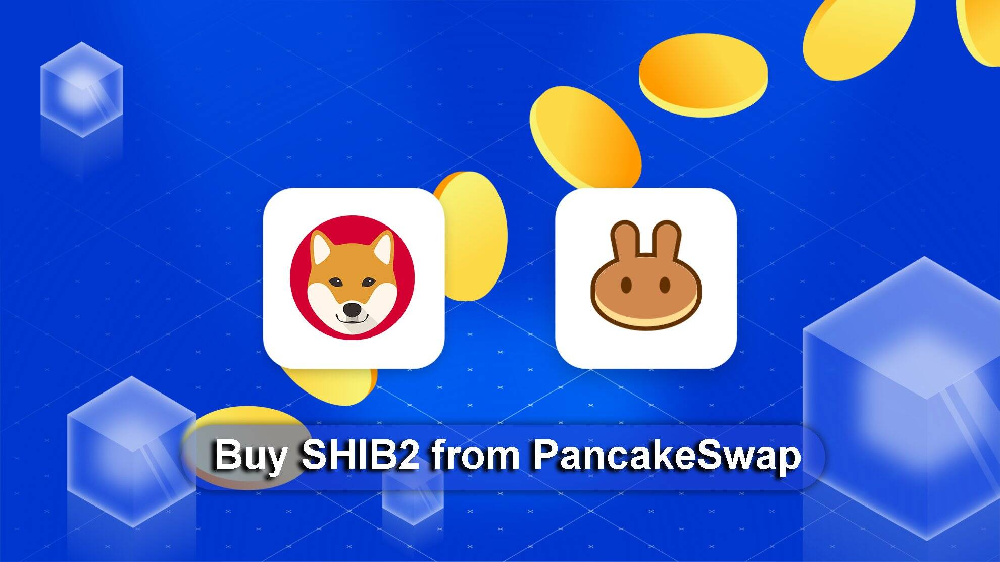

# ShibaInu2

ShibaInu2 的使命是为普通人带来加密货币，同时帮助拯救需要帮助的狗。 ShibaInu2 建立在 binancesmart 链上，具有极快的出块时间和比以太坊更便宜的汽油费。他是超通缩的，具有奖励持有者的静态反射，因此每次交易都会自动将更多 ShibaInu2 代币添加到您的钱包中。在币安智能链上运行的 ShibaInu2 是最新的加密货币，是 meme 父亲 Shiba Inu 的后代。更具体地说，它是一种超通缩子币，在生态系统中内置了智能共享系统，因此每个投资者的钱包中都添加了更多 shibainu2。这意味着每位持卡人每进行一次交易都会获得 %5 的佣金。想象一下，甚至在新代币发布之前就能够立即跟踪它们，同时确保购买它们是否安全。

