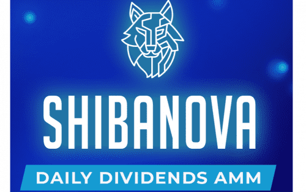

# ShibaNova

ShibaNova 是基于币安智能链的去中心化交易所 (DEX) 和自动做市商 (AMM)。我们的目标是解决去中心化金融 (DeFi) 中的一个基本问题，即项目的原生代币在启动时价值上升，但价值日复一日地逐渐下降，直到最终降至零。我们通过将我们的投资者转变为有价值的股东来解决这个问题 - 有资格获得他们在我们的 dApp 中收取的 75% 费用的份额。通过为我们的项目提供流动性并创建/持有我们的股息代币，我们的股东能够每天赚取被动收入。这种每日分红系统不仅可以激励长期持有，还可以促进整个社区对项目的所有权。这就是我们对 DeFi 2.0 的愿景——可持续、安全、成功、跨链、通用。

