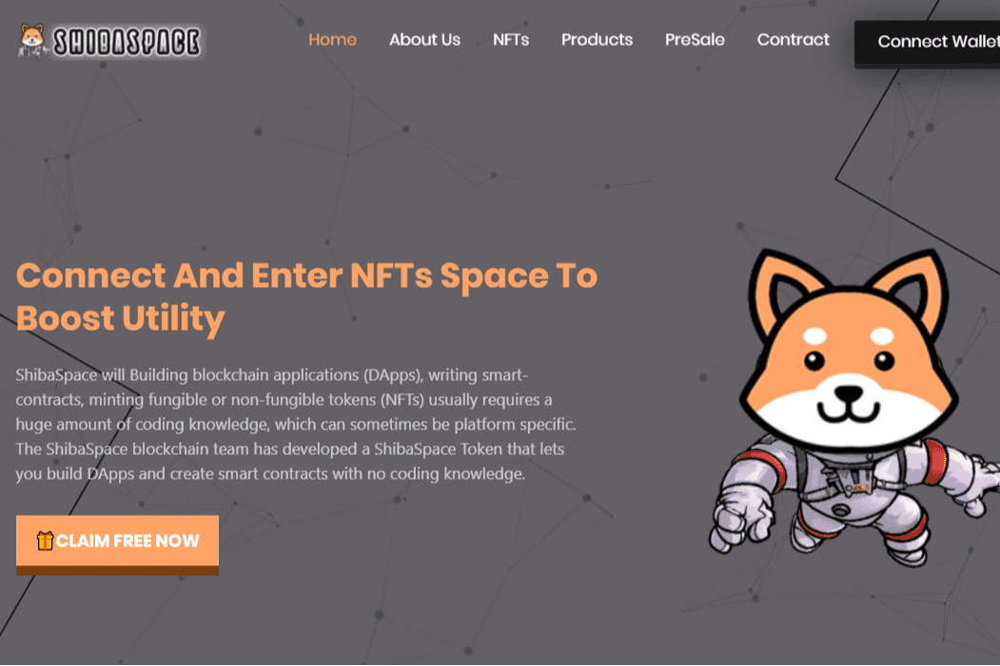

# ShibaSpace

连接并进入 NFT 空间以提升实用程序
ShibaSpace 将构建区块链应用程序 (DApp)、编写智能合约、铸造可替代或不可替代的代币 (NFT) 通常需要大量的编码知识，这些知识有时可能是特定于平台的。 ShibaSpace 区块链团队开发了一个 ShibaSpace 代币，让您无需编码知识即可构建 DApp 并创建智能合约。使用简单的可视化界面来创建和管理可替代和不可替代的代币。ShibaSpace 网络具有高度安全的系统，如以太坊主网络和币安智能链算法。

