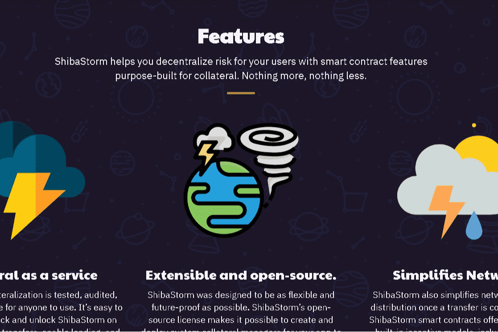

# ShibaStorm

让我们把钱带入21世纪。
定义|ShibaStorm 将为 DAI、ANKR、SHIBASTORM 等资产提供即时、可验证的保证，适用于任何实际应用。
特征：ShibaStorm 通过专门为抵押品构建的智能合约功能帮助您为用户分散风险。不多也不少

ShibaStorm 将为 DAI、ANKR、SHIBASTORM 等资产提供即时、可验证的保证，适用于任何实际应用。ShibaStorm 旨在尽可能灵活和面向未来。ShibaStorm 的开源许可证使您可以为您的应用程序创建和部署自定义附属管理器，以便按照您自己的条件与 ShibaStorm 交互。

