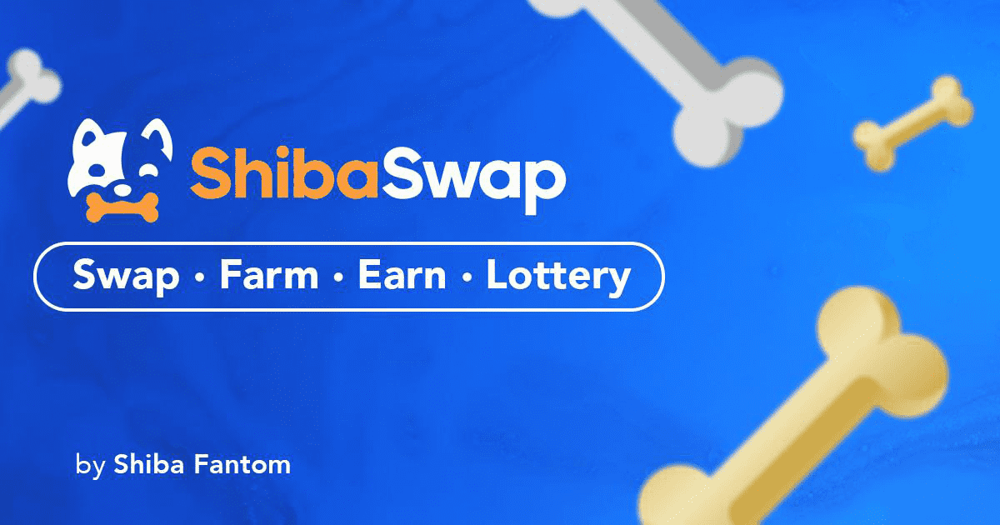

# ShibaSwap Fantom

ShibaSwap 是一种单产农业和单产聚合器协议，由 Fantom 提供支持。我们是一个专注于慈善和合作的社区收藏。ShibaSwap是一个建立在尊重、善良和慈善基础上的不断发展的社区。现在，通过利用 Fantom 区块链技术的力量，几乎可以即时进行环保交易，并减少 99.9% 的费用。

Shiba Fantom 旨在成为由社区成员建立并充满协作的友好、乐于助人和令人惊叹的社区。这是通过成为 Fantom 的首选“meme-friendly”面孔来实现的，专注于与有意义的项目的增长和协作。

