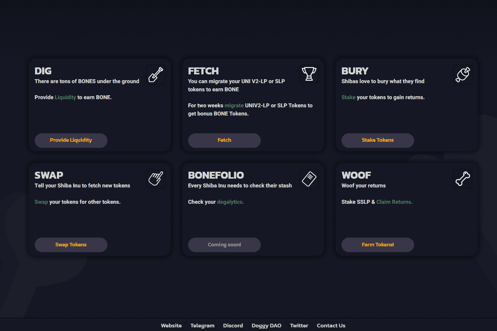

# ShibaSwap

从一开始，柴犬就以不同的方式做事。我们的创始人 Ryoshi 从 1 万亿的供应开始，将 50% 锁定在 Uniswap，然后将另一半“烧掉”给以太坊联合创始人 Vitalik Buterin 保管。为了帮助扭转 Covid-19 在印度的毁灭性蔓延，VB 此后在历史上最大的加密货币捐赠中使用了 SHIB，然后实际上将其总供应量的 40% 烧毁了一个死钱包，确保了我们的长期成功和稳定性。用 Ryoshi 的话来说，“感谢 woofmeister 实现了真正的去中心化。现在我们真正开始了。”

