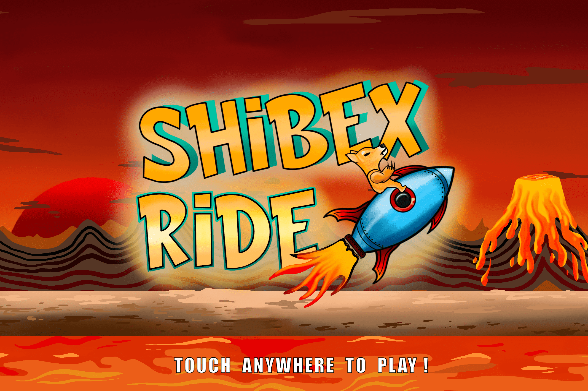

# Shibex

Shibex 代币
Shibex 是一个 Gamefi 平台，其中 SHIBX 是允许玩家与其他玩家玩和下注他们的 SHIBX 代币的代币。该平台将定期为街机游戏提供午餐，SHIBX 将成为所有游戏的实用代币。游戏经济学是一种称为“play2burn”的新机制，其中部分投注在游戏中的代币被烧毁，直到代币从供应中得到 20%，然后代币将返还给持有者并提供流动性。我们想为 IoTeX 社区 Shibex 带来一个基于游戏的代币，但它具体是什么🤔？ Shibex 是让您畅玩由才华横溢的 Shibex 团队开发的所有游戏的代币，我们计划从 2 月开始每月制作一款多人街机游戏，以提升 Shibex 代币的价值！
Shibex 背后的经济系统使代币如此特别！

