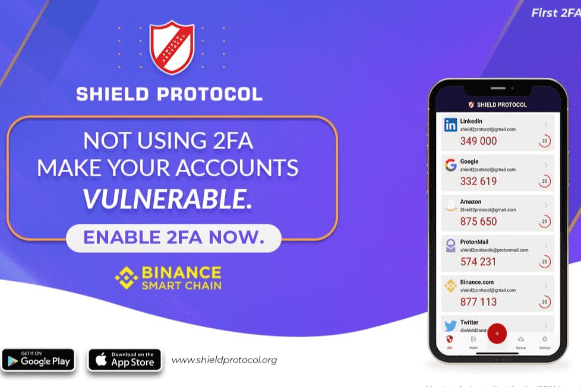

# Shield Protocol

Shield Protocol是基于币安智能链的第二层安全平台。 Shield Protocol App 在区块链和 BSC 钱包上具有 2FA。 Shield Protocol App 提供 2FA（双因素身份验证），它位于区块链之上的无服务器 p2p 架构上，其中每个日志都记录到分散的分类帐中以实现透明度，并且没有任何数据可以帮助识别应用程序中的用户，在隐私和匿名方面帮助用户，并且通过使用区块链，整个系统是防篡改的。 Shield Protocol App 还具有 BSC 钱包 (BEP-20)，支持 BNB、BUSD、SHIELD、USDC、USDT 和 WBNB。

