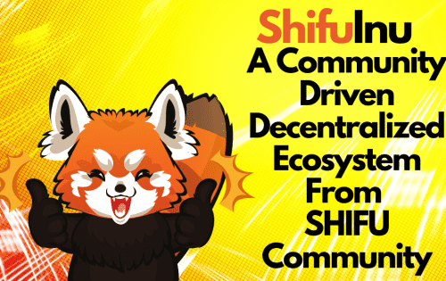

# Shifu Inu

Shifu Inu 是一个社区驱动的去中心化生态系统。
Shifu 不仅仅是一个 meme 代币，它是由社区为社区开发的社区驱动代币。
师父持有者将通过静态反射获得被动奖励，看着您的师父天平到达月球。
Shifu 具有自动锁定流动性，可实现不断上涨的价格下限。
Shifu 生态系统 100% 安全可靠。
50% 的供应被烧毁！并且在每笔交易中 5% 也会被销毁（转到没有所有者的 0x 钱包）。
师傅是数字世界中最强大的社区之一。社区就是一切，师傅努力让世界各地的每个人都参与进来。
Shifu Inu 长期在这里。去中心化社区正在促进和采用生态系统和基础的长期发展，以努力推动实际用例。
Shifu Inu 为 Red Panda Guardians 预留了 15% 的总供应量！并将为小熊猫社区提供庇护所。

