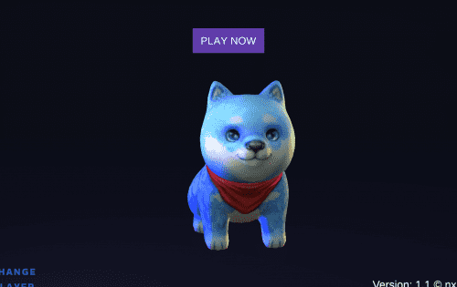

# ShiPlay

介绍 ShiPlay 元宇宙
Shiba 的粉丝们！为全世界的 Shiba 爱好者推出首个 3D Shiba 游戏！
那么什么是Shiplay呢？
简而言之，Shiplay 是一款 3D 游戏，您可以在其中购买 Shiba NFTS 并教您的 Shiba 技巧、赚钱或与其他 Shiba 爱好者一起玩！您可以与其他 Shiba 交流，在 1.2 版本中您可以玩我们的第一个 Shiba 游戏来赚取 BNB。版本 1.2 也被开发用于 Android 操作系统。
您可以与 Shiba 一起探索新世界，并将区块链 NFTS 继承到您的 Shiba 中，您可以直接在游戏中交易和交换 NFTS，并在 Selling Block 中与 Shiba 进行交流，以交换您的密钥上注册的 NFTS。
我们希望将 Shiplay 打造成一个免费且易于使用的平台，让世界各地的人们享受玩元界游戏，而无需冲向大型科技公司无法负担的昂贵游戏。 Metaverse 中的下一个赢家不会是大型科技公司，而是那些多年来致力于区块链技术并且真正去中心化的小型未知公司。没有大型科技公司会使用去中心化技术，因为它根本不会让他们赚到他们希望的大笔钱。为了具有竞争力，他们需要了解区块链必须去中心化并保护人们的隐私。
这需要创新，这就是 Shibplay 存在的原因。
Pinksale 将于 2022 年 1 月 22 日下午 4 点 UTC 发布。

