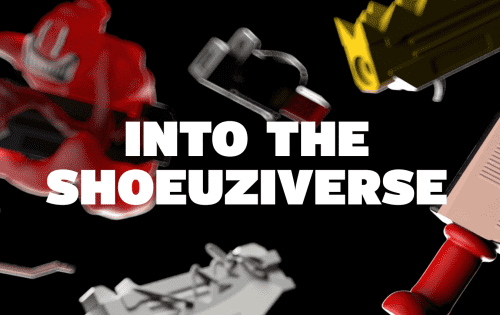

# Shoeuziverse

Shoeuziverse 是一个游戏化的 nft 项目，耗资 10,000 个生成式分散设计。玩家需要收集 2d 插图的分散鞋子 nfts 并结合匹配的特征来生成完整的 3d 渲染版本。
在生成 Complete shoeuzi nft 时，使用的分散的会在此过程中被烧毁。这意味着随着游戏赛季的进行，供应量会越来越低。
当玩家生成 10+ 个完整的 nft 时，他们就有资格在现实生活中由 shoeuzi 铸造一个。这是一个 1/1 标记和签名的鞋头雕塑。
Complete shoeuzis 有新的特性，这是因为完整的 shoeuzis 可以在 shoeuzi 竞技场中玩。什么是shoeuzi竞技场？它是我们为 Metaverse 制作的多人第一人称射击游戏！
我们已经在谈判土地并开发游戏。您的完整 shoeuzi nfts（以及您的其他 nft pfps/可穿戴设备等）都可以在游戏中使用。

