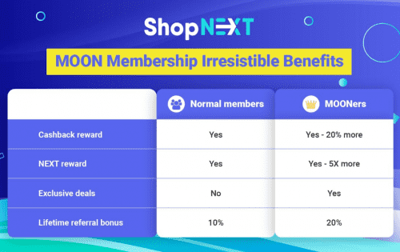

# ShopNEXT

ShopNEXT 是 Binance 推广的 Shop-To-Earn 加密入门平台。我们通过在 ShopNEXT 合作伙伴购物时奖励他们免费的加密货币（比特币、以太坊、BNB、USDT）来吸引新的加密货币用户。
此外，对于每笔购物交易，ShopNEXT 还会奖励用户额外的 NEXT，即 ShopNEXT 发行的加密货币。用户可以在 DEX 和 CEX 交易所出售 NEXT 来赚钱。这是 ShopNEXT 想要建立的第一个 Shop-To-Earn 模型。
ShopNEXT 由越南顶级现金返还平台 Shopiness 提供支持。 Shopiness 目前拥有 700.000 名用户和 100.000 MAU，每月从 100 万笔交易中产生 400 万美元的 GMV。 ShopNEXT 已与 600 多个本地和全球商家品牌合作，例如：Shopee、Lazada、亚马逊、阿迪达斯、Booking.com 等。

